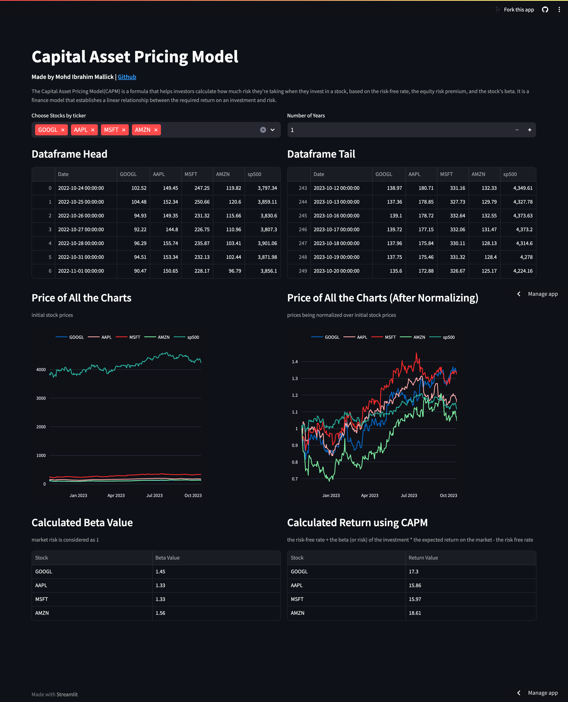

<h1 align="center">
    Capital Asset Pricing Model
</h1>

## About
- The *CAPM Financial Analysis* project is a Python-based implementation of the Capital Asset Pricing Model. 
- CAPM is a formula that helps investors calculate how much risk they're taking when they invest in a stock, based on the risk-free rate, the equity risk premium, and the stock's beta. 
- The application uses libraries such as `Pandas`, `NumPy`, `Streamlit`, and `Plotly`, to gather stock data from Yahoo Finance and perform calculations to determine expected returns.

---

### [Live Website](https://capm-finance.streamlit.app/)

---

## Usage
The CAPM Financial Analysis application allows you to select a list of stocks and specify the number of years for investment. It then calculates the expected returns for each stock based on the CAPM formula and displays the results. Follow these steps:

* Choose stocks by ticker:
  * Use the multi-select input to choose one or more stocks by their tickers.
  * Available stock tickers are provided in the dropdown menu.
* Specify the number of years of investment:
  * Use the number input to enter the number of years you plan to invest.
* View the results:
  * The application retrieves historical stock price data for the selected stocks and the S&P 500 index.
  * It normalizes the stock prices based on the initial prices and displays both the initial and normalized prices in an interactive plot.
  * It calculates the beta values and alpha values for each stock based on the daily returns.
  * The calculated beta values and alpha values are displayed in a table.
  * The application calculates the expected returns using the CAPM formula and displays them in a table.
* Interpret the results:
  * The normalized prices plot helps visualize the performance of selected stocks relative to the initial prices.
  * The calculated beta values indicate the riskiness of each stock relative to the market (S&P 500).
  * The expected returns table shows the estimated returns for each stock based on the CAPM formula.

## Notes
* The S&P 500 index is used as a benchmark for the market return.
* The application retrieves historical stock price data using the Yahoo Finance API (via the `yfinance` library) and the S&P 500 data from the FRED database (via the `pandas_datareader` library).

## Conclusion
The CAPM Financial Analysis application provides an interactive interface for calculating expected returns based on CAPM. By selecting stocks and specifying the investment period, users can estimate the returns and analyze the riskiness of their investment choices.